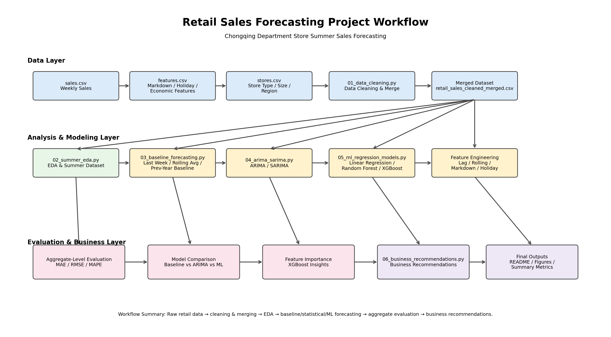
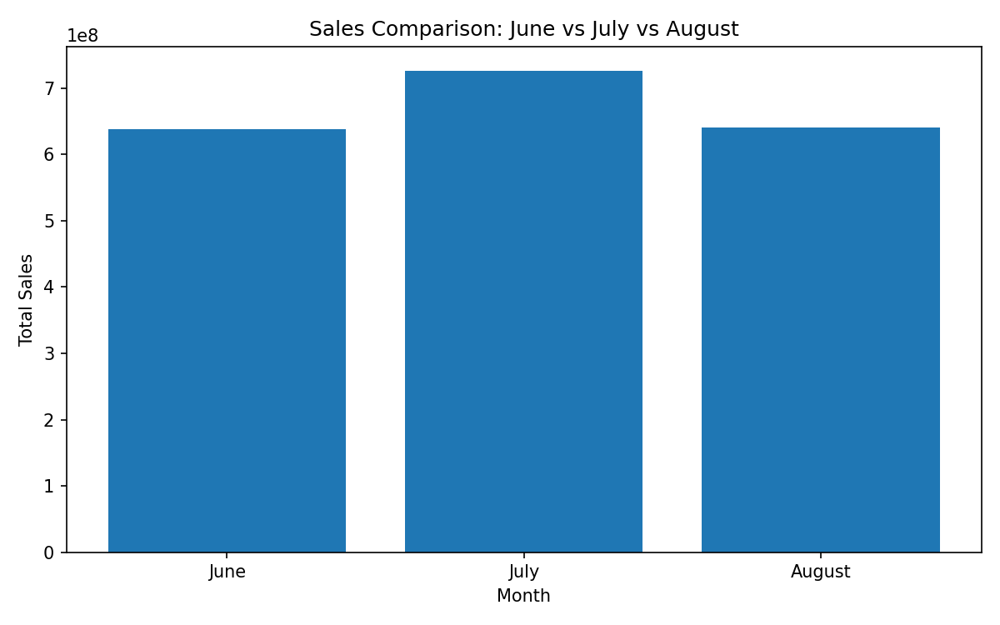
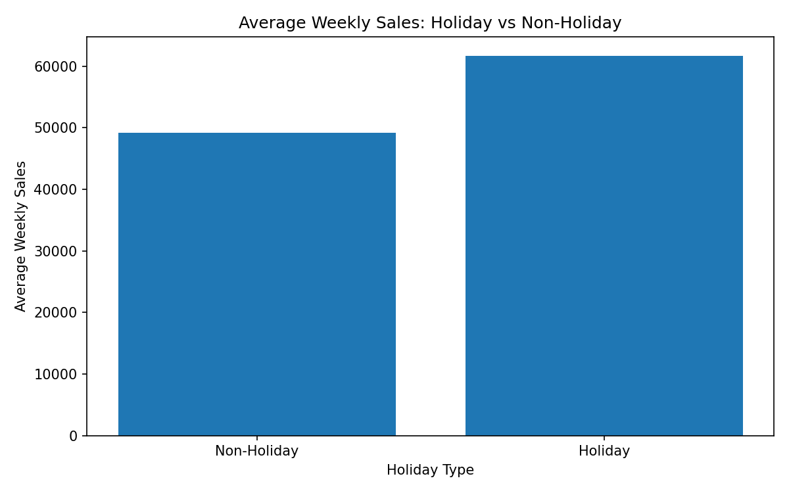
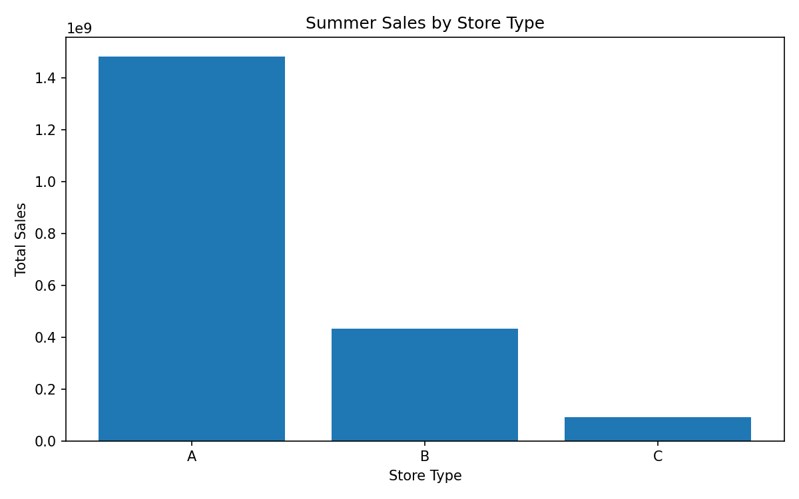
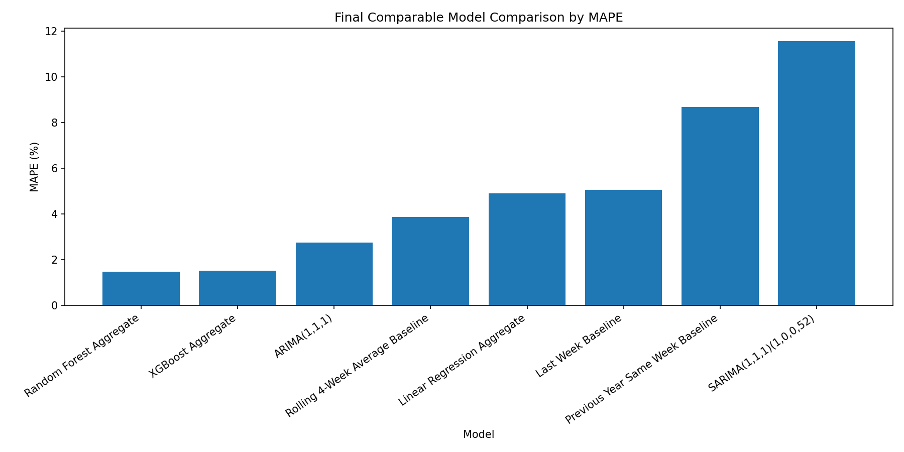

# Chongqing Department Store Summer Sales Forecasting

A reproducible retail sales forecasting project inspired by a local department store analytics internship in Chongqing.
Due to data confidentiality, this project does not use the original company dataset. Instead, it uses a public multi-table retail forecasting dataset with a similar structure to reproduce the workflow of data cleaning, exploratory analysis, forecasting model comparison, and business recommendation generation.

---

## 1. Project Objective

The objective of this project is to forecast summer weekly retail sales and translate forecasting results into practical business recommendations for:

* summer promotion scheduling
* inventory preparation
* store operation planning
* regional resource allocation
* staffing arrangement during high-demand weeks

The analysis focuses on the summer period from **June to August** and compares naive baselines, statistical time-series models, and machine learning regression models.

---

## 2. Dataset Overview

The dataset contains three related retail tables:

| File           | Description                                                                               |
| -------------- | ----------------------------------------------------------------------------------------- |
| `sales.csv`    | Historical weekly sales records across stores and departments                             |
| `features.csv` | External features such as temperature, markdowns, holidays, CPI, unemployment, and season |
| `stores.csv`   | Store metadata including store type, store size, and region                               |

After cleaning and merging the three tables, the final dataset contains:

| Item                   |                    Value |
| ---------------------- | -----------------------: |
| Date range             | 2022-01-01 to 2024-12-21 |
| Stores                 |                       50 |
| Departments            |                       20 |
| Weekly sales records   |                  156,000 |
| Summer modeling period |       June, July, August |
| Summer test period     |        2024 summer weeks |

---

## 3. Project Workflow

This project follows an end-to-end retail forecasting workflow:

```text
Raw Data
→ Data Cleaning
→ Multi-table Merging
→ Summer Sales EDA
→ Baseline Forecasting
→ ARIMA / SARIMA Modeling
→ Machine Learning Regression
→ Aggregate-level Evaluation
→ Feature Importance Analysis
→ Business Recommendations
```

### Project Workflow Diagram

The figure below summarizes the full project pipeline from raw retail data to model evaluation and business recommendations.



---

## 4. Project Structure

```text
chongqing-summer-sales-forecasting/
├── data/
│   ├── raw/
│   │   ├── sales.csv
│   │   ├── features.csv
│   │   └── stores.csv
│   └── processed/
│       ├── sales_cleaned.csv
│       ├── features_cleaned.csv
│       ├── stores_cleaned.csv
│       ├── retail_sales_cleaned_merged.csv
│       └── summer_sales.csv
│
├── src/
│   ├── 01_data_cleaning.py
│   ├── 02_summer_eda.py
│   ├── 03_baseline_forecasting.py
│   ├── 04_arima_sarima.py
│   ├── 05_ml_regression_models.py
│   ├── 06_business_recommendations.py
│   └── 07_project_workflow_diagram.py
│
├── outputs/
│   ├── figures/
│   ├── final_comparable_model_comparison.csv
│   ├── ml_aggregate_model_comparison.csv
│   ├── xgboost_feature_importance.csv
│   ├── business_summary_metrics.csv
│   └── business_recommendations.md
│
├── models/
├── sql/
├── notebooks/
├── README.md
└── requirements.txt
```

---

## 5. Data Cleaning and Preparation

The data preparation process includes:

* standardizing column names
* converting date fields into datetime format
* checking missing values and duplicated rows
* filling missing holiday labels with `Non-Holiday`
* treating missing markdown values as zero
* merging `sales.csv`, `features.csv`, and `stores.csv`
* creating summer-specific indicators
* generating a cleaned modeling dataset

The final merged dataset is saved as:

```text
data/processed/retail_sales_cleaned_merged.csv
```

The summer-specific dataset is saved as:

```text
data/processed/summer_sales.csv
```

---

## 6. Exploratory Data Analysis

The summer EDA focused on sales patterns across years, months, holidays, markdowns, store types, regions, and departments.

### Key EDA Findings

| Business Question                  | Finding                                                                 |
| ---------------------------------- | ----------------------------------------------------------------------- |
| Did summer sales grow over time?   | Summer sales increased by approximately 7.64% from 2022 to 2024         |
| Which summer month performed best? | July generated the highest total summer sales                           |
| Do holiday weeks matter?           | Holiday weeks showed higher average weekly sales than non-holiday weeks |
| Which store type contributed most? | Store Type A contributed the largest share of total summer sales        |
| Which region performed best?       | East region had the highest total summer sales                          |

### Summer Sales by Month

July produced the highest total summer sales, making it the key period for promotion scheduling and inventory preparation.



### Holiday vs Non-Holiday Sales

Holiday weeks generated higher average weekly sales than non-holiday weeks.



### Sales by Store Type

Store Type A contributed the largest share of total summer sales.



---

## 7. Baseline Forecasting

Before building statistical and machine learning models, several naive baseline models were created:

| Baseline Model                   | Description                                 |
| -------------------------------- | ------------------------------------------- |
| Last Week Baseline               | Uses previous week sales as the forecast    |
| Rolling 4-Week Average Baseline  | Uses the average of the previous four weeks |
| Previous Year Same Week Baseline | Uses the same week from the previous year   |

The strongest baseline was:

| Model                           |  MAPE |
| ------------------------------- | ----: |
| Rolling 4-Week Average Baseline | 3.87% |

This baseline was used as the main benchmark for evaluating more advanced forecasting models.

---

## 8. Statistical Time-Series Models

Two statistical time-series models were tested at the aggregate weekly sales level:

* ARIMA(1,1,1)
* SARIMA(1,1,1)(1,0,0,52)

### Statistical Model Results

| Model                   |   MAPE |
| ----------------------- | -----: |
| ARIMA(1,1,1)            |  2.76% |
| SARIMA(1,1,1)(1,0,0,52) | 11.55% |

ARIMA performed better than SARIMA.
SARIMA likely performed worse because the available training period was not long enough to estimate a stable 52-week seasonal pattern.

---

## 9. Machine Learning Models

Machine learning models were trained at the `store_id + department + week` level.

### Models Compared

* Linear Regression
* Random Forest Regressor
* XGBoost Regressor

### Feature Engineering

The following feature groups were created:

| Feature Group        | Examples                                            |
| -------------------- | --------------------------------------------------- |
| Calendar features    | year, month, week_of_year                           |
| Store features       | store_id, store_type, store_size, region            |
| Holiday features     | is_holiday, holiday_name, season                    |
| Markdown features    | markdown_1 to markdown_5, total_markdown            |
| Economic features    | CPI, unemployment, fuel_price                       |
| Time-series features | lag_1, lag_4, lag_8, rolling_mean_4, rolling_mean_8 |

All lag and rolling features were shifted before modeling to avoid data leakage.

---

## 10. Final Model Performance

Machine learning predictions were first generated at the store-department-week level and then aggregated by date to evaluate total weekly sales forecasting performance.

### Final Comparable Model Results

| Rank | Model                            |   MAPE |
| ---: | -------------------------------- | -----: |
|    1 | Random Forest Aggregate          |  1.48% |
|    2 | XGBoost Aggregate                |  1.52% |
|    3 | ARIMA(1,1,1)                     |  2.76% |
|    4 | Rolling 4-Week Average Baseline  |  3.87% |
|    5 | Linear Regression Aggregate      |  4.89% |
|    6 | Last Week Baseline               |  5.05% |
|    7 | Previous Year Same Week Baseline |  8.69% |
|    8 | SARIMA                           | 11.55% |

The best aggregate-level model was **Random Forest Aggregate**, achieving a MAPE of **1.48%**.

Compared with the strongest naive baseline, the model reduced MAPE from **3.87%** to **1.48%**, representing an error reduction of approximately **61.74%**.

### Final Model Comparison



### 2024 Summer Weekly Sales Forecast

The figure below compares actual 2024 summer weekly sales with predictions from Linear Regression, Random Forest, and XGBoost.


---

## 11. Feature Importance Analysis

XGBoost feature importance was used to understand which factors contributed most to weekly sales prediction.

Important sales drivers included:

* store type
* holiday indicators
* rolling historical sales
* store size
* month
* markdown intensity
* department-level differences

### XGBoost Feature Importance


---

## 12. Business Recommendations

Based on EDA results, model performance, and feature importance analysis, the following business recommendations were generated.

### 1. Strengthen promotion planning around July

July produced the highest total summer sales.
Marketing campaigns, membership events, and seasonal discounts should be concentrated around this period.

### 2. Prepare inventory earlier for high-performing departments

Top-performing departments should receive earlier replenishment planning before expected high-demand weeks.

### 3. Allocate more staff during holiday and high-demand weeks

Holiday weeks showed higher average weekly sales.
Additional cashier, sales assistant, and store-floor support should be arranged during these periods.

### 4. Prioritize Store Type A and East region

Store Type A and the East region contributed the highest summer sales.
Inventory allocation and promotional resources should prioritize these high-performing segments.

### 5. Use weekly sales forecasts as an operational early-warning tool

The forecast results can help management identify upcoming peak weeks and prepare promotion schedules, inventory allocation, and staffing plans in advance.

---

## 13. Tools and Libraries

| Category                | Tools                 |
| ----------------------- | --------------------- |
| Programming             | Python                |
| Data processing         | Pandas, NumPy         |
| Visualization           | Matplotlib            |
| Statistical modeling    | Statsmodels           |
| Machine learning        | Scikit-learn, XGBoost |
| Development environment | VSCode                |
| Version control         | Git, GitHub           |

---

## 14. How to Run

Create and activate a virtual environment:

```powershell
python -m venv .venv
.venv\Scripts\activate
```

Install dependencies:

```powershell
pip install pandas numpy matplotlib scikit-learn statsmodels xgboost openpyxl
```

Run the project scripts in order:

```powershell
python src/01_data_cleaning.py
python src/02_summer_eda.py
python src/03_baseline_forecasting.py
python src/04_arima_sarima.py
python src/05_ml_regression_models.py
python src/06_business_recommendations.py
python src/07_project_workflow_diagram.py
```

---

## 15. Key Outputs

| Output                                  | Description                         |
| --------------------------------------- | ----------------------------------- |
| `retail_sales_cleaned_merged.csv`       | Cleaned and merged modeling dataset |
| `summer_sales.csv`                      | Summer-specific sales dataset       |
| `baseline_model_comparison.csv`         | Naive baseline model results        |
| `arima_sarima_model_comparison.csv`     | Statistical model results           |
| `ml_model_comparison.csv`               | Store-department-level ML results   |
| `final_comparable_model_comparison.csv` | Aggregate-level final comparison    |
| `xgboost_feature_importance.csv`        | XGBoost feature importance table    |
| `business_recommendations.md`           | Business recommendation report      |

---

## 16. Interview Summary

This project demonstrates an end-to-end retail forecasting workflow. I first cleaned and merged sales, store, and external feature tables, then focused on summer weekly sales from June to August. I built naive baselines, ARIMA/SARIMA models, and machine learning regression models using engineered lag, rolling average, markdown, holiday, and store-level features.

At the aggregate weekly sales level, Random Forest achieved the best MAPE of around 1.48%, while XGBoost achieved a similar MAPE of around 1.52%. Both models outperformed the rolling 4-week average baseline and ARIMA model. Finally, I translated the forecasting results into business recommendations for promotion planning, inventory preparation, staffing allocation, and regional resource planning.

---

## 17. Disclaimer

This project is inspired by a retail analytics internship scenario at a local department store in Chongqing.
The original company data is not used due to confidentiality. This repository uses a public retail forecasting dataset with a similar structure to reproduce the technical workflow and business analysis logic.
