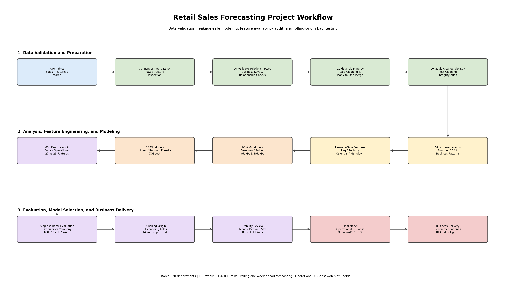
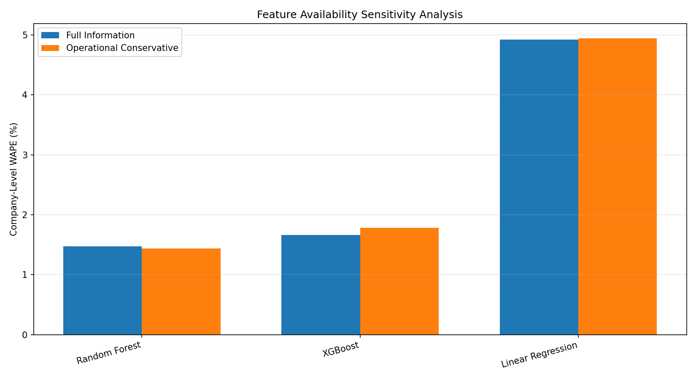
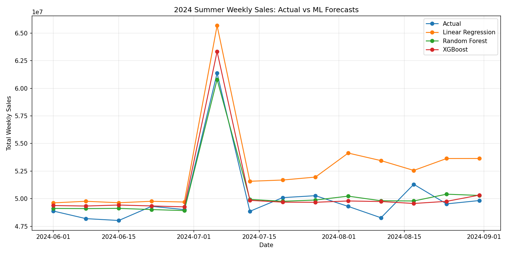
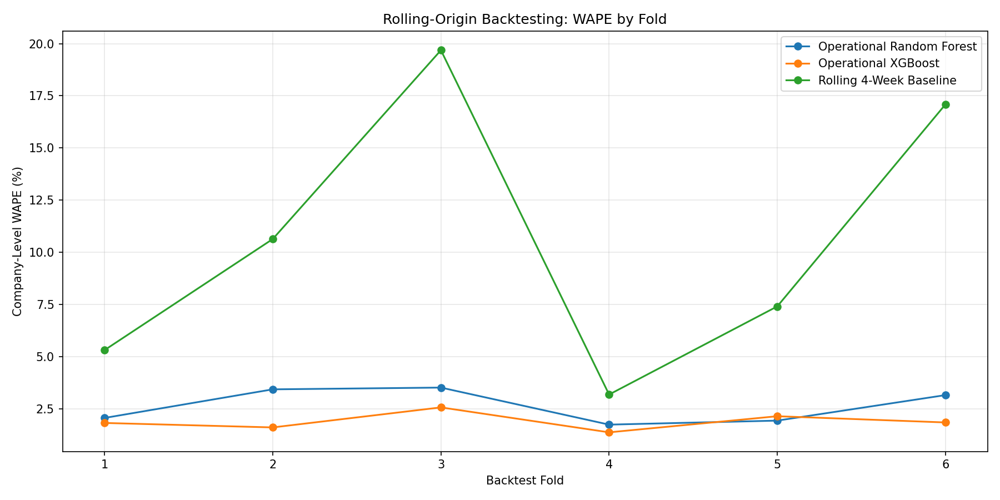
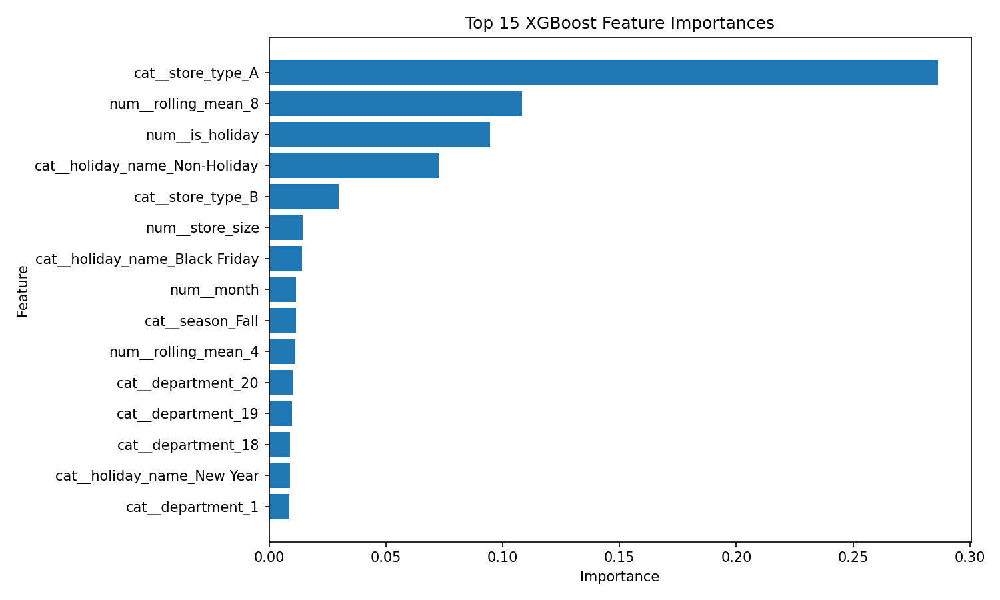

# Chongqing Department Store Sales Forecasting

An end-to-end retail forecasting portfolio project covering data validation, leakage-safe feature engineering, baseline and time-series models, machine-learning regression, forecast-time feature auditing, and multi-window rolling-origin backtesting.

> **Data disclosure:** this repository does not claim to use confidential internal data from a real Chongqing retailer. The dataset is treated as a structured educational, synthetic, or adapted retail dataset, while the Chongqing department-store context is used as a business scenario.

---

## 1. Project Objective

The project aims to forecast weekly retail sales and convert model outputs into practical planning insights for:

- sales planning
- promotion scheduling
- inventory preparation
- staffing
- store operations
- seasonal resource allocation

The modelling pipeline produces predictions at the `store_id + department + week` level and also evaluates aggregate company-level weekly sales.

---

## 2. Dataset Overview

The project uses three related tables:

| Table | Description |
|---|---|
| `sales.csv` | Weekly store-department sales records |
| `features.csv` | Calendar, markdown, economic, and environmental variables |
| `stores.csv` | Store metadata such as type, size, and region |

After validation and merging, the modelling dataset contains:

| Item | Value |
|---|---:|
| Date range | 2022-01-01 to 2024-12-21 |
| Stores | 50 |
| Departments per store | 20 |
| Weekly dates | 156 |
| Store-department-week rows | 156,000 |
| Business key | `store_id + department + date` |

The panel is balanced:

```text
50 stores × 20 departments × 156 weeks = 156,000 rows
```

For source positioning, assumptions, and limitations, see:

- [`docs/02_data_source_and_assumptions.md`](docs/02_data_source_and_assumptions.md)
- [`docs/03_feature_availability.md`](docs/03_feature_availability.md)

---

## 3. Methodology Overview

```text
Raw Data Inspection
→ Business-Key and Relationship Validation
→ Safe Cleaning and Many-to-One Merging
→ Post-Cleaning Integrity Audit
→ Exploratory Data Analysis
→ Baseline Forecasting
→ Rolling ARIMA / SARIMA
→ Machine-Learning Regression
→ Forecast-Time Feature Availability Audit
→ Multi-Window Rolling-Origin Backtesting
→ Final Model Selection
→ Business Interpretation
```



---

## 4. Project Structure

```text
chongqing-summer-sales-forecasting/
├── data/
│   ├── raw/
│   │   ├── sales.csv
│   │   ├── features.csv
│   │   └── stores.csv
│   └── processed/
│       └── retail_sales_cleaned_merged.csv
│
├── docs/
│   ├── 01_problem_definition.md
│   ├── 02_data_source_and_assumptions.md
│   └── 03_feature_availability.md
│
├── src/
│   ├── 00_inspect_raw_data.py
│   ├── 00_validate_relationships.py
│   ├── 01_data_cleaning.py
│   ├── 00_audit_cleaned_data.py
│   ├── 02_summer_eda.py
│   ├── 03_baseline_forecasting.py
│   ├── 04_arima_sarima.py
│   ├── 05_ml_regression_models.py
│   ├── 05b_feature_availability_sensitivity.py
│   ├── 06_rolling_origin_backtesting.py
│   ├── 07_business_recommendations.py
│   └── 08_project_workflow_diagram.py
│
├── outputs/
│   ├── figures/
│   ├── final_comparable_model_comparison.csv
│   ├── feature_availability_sensitivity.csv
│   ├── rolling_origin_fold_results.csv
│   ├── rolling_origin_summary.csv
│   └── rolling_origin_fold_winners.csv
│
├── models/
├── notebooks/
├── sql/
├── README.md
└── requirements.txt
```

---

## 5. Data Validation and Cleaning

Before modelling, the project validates the structure and relationships of all source tables.

### Validation Results

- `sales.csv`: 156,000 rows
- `features.csv`: 7,800 rows
- `stores.csv`: 50 rows
- no duplicate business keys
- all store-date feature joins are valid
- all store joins are valid
- safe `many_to_one` merge checks pass
- merged row count remains 156,000
- raw and cleaned total sales reconcile exactly
- no negative or zero sales values were found
- holiday labels and holiday flags are internally consistent

The cleaning process includes:

- standardising column names
- converting date columns
- checking missing values and duplicates
- filling missing holiday labels
- treating missing markdown values as zero
- validating business-key uniqueness
- using merge indicators and relationship validation
- preserving row counts and total sales

---

## 6. Leakage-Safe Feature Engineering

Machine-learning models are trained at the store-department-week level.

### Feature Groups

| Feature group | Examples |
|---|---|
| Calendar | `year`, `month`, `week_of_year`, `season` |
| Store metadata | `store_id`, `store_type`, `store_size`, `region` |
| Department | `department` |
| Holiday | `is_holiday`, `holiday_name` |
| Planned promotion | `markdown_1` to `markdown_5`, `total_markdown` |
| Historical sales | `lag_1`, `lag_4`, `lag_8` |
| Rolling sales | `rolling_mean_4`, `rolling_mean_8`, `rolling_std_4` |

All rolling features are calculated after `shift(1)`:

```python
series.shift(1).rolling(...)
```

This prevents the target week from contributing to its own predictors.

After generating lag and rolling features:

```text
156,000 original rows
→ 148,000 modelling rows
```

The removed 8,000 rows correspond to the first eight observations of each of the 1,000 store-department series.

---

## 7. Forecasting Scenarios

### Full-Information Benchmark

The benchmark includes all available features, including:

- temperature
- fuel price
- CPI
- unemployment

This measures predictive potential but may use variables that are not fully available when the forecast is generated.

### Operational Conservative Scenario

The operational model removes:

- `temperature`
- `fuel_price`
- `cpi`
- `unemployment`

It retains:

- calendar information
- store and department attributes
- holiday information
- leakage-safe historical sales features
- planned markdown features

The operational scenario reduces the feature count from 27 to 23.

### Feature Availability Sensitivity

| Model | Full WAPE | Operational WAPE | Change |
|---|---:|---:|---:|
| Random Forest | 1.4714% | 1.4361% | -0.0353 pp |
| XGBoost | 1.6661% | 1.7844% | +0.1183 pp |
| Linear Regression | 4.9222% | 4.9411% | +0.0189 pp |

Removing potentially unavailable contemporaneous variables did not materially reduce performance.



---

## 8. Models Compared

### Naive Baselines

- Last Week Baseline
- Rolling 4-Week Average
- Previous Year Same Week

### Statistical Models

- ARIMA(1,1,1)
- SARIMA(1,1,1)(1,0,0,52)

ARIMA and SARIMA are evaluated using rolling one-week-ahead forecasts. Model parameters are fitted on the training period, and the state is updated as each new actual observation becomes available.

### Machine-Learning Models

- Linear Regression
- Random Forest Regressor
- XGBoost Regressor

---

## 9. Evaluation Metrics

The project reports:

- **MAE** — mean absolute error
- **RMSE** — root mean squared error
- **MAPE** — mean absolute percentage error
- **WAPE** — total absolute error divided by total actual sales
- **Forecast Bias** — signed over- or under-forecast percentage

Two evaluation levels are kept separate:

| Level | Description |
|---|---|
| `store_department_week` | Granular operational prediction |
| `company_week` | Aggregate planning prediction |

This avoids incorrectly comparing 14,000 granular observations with 14 aggregate weekly totals.

---

## 10. Single-Window Model Comparison

For the 2024 summer evaluation window, the company-level comparison was:

| Rank | Model | MAPE | WAPE | Bias |
|---:|---|---:|---:|---:|
| 1 | Random Forest Aggregate | 1.48% | 1.47% | +0.56% |
| 2 | XGBoost Aggregate | 1.64% | 1.67% | +0.88% |
| 3 | ARIMA Rolling | 3.67% | 3.95% | -0.29% |
| 4 | Rolling 4-Week Average | 3.87% | 4.17% | -0.31% |
| 5 | Linear Regression Aggregate | 4.89% | 4.92% | +4.92% |
| 6 | Last Week Baseline | 5.05% | 5.31% | +0.07% |
| 7 | Previous Year Same Week | 8.69% | 8.90% | +3.45% |
| 8 | SARIMA Rolling | 12.51% | 13.00% | +3.92% |

The single-window result initially favoured Random Forest. However, final model selection is based on multi-window backtesting rather than one test period.



---

## 11. Rolling-Origin Backtesting

To test model stability across seasons, the project uses six expanding-window backtest folds.

Each fold contains:

- an expanding training window
- 14 consecutive test weeks
- one-week-ahead operational features
- company-level aggregate evaluation

### Fold Plan

| Fold | Train end | Test period |
|---:|---|---|
| 1 | 2023-05-13 | 2023-05-20 to 2023-08-19 |
| 2 | 2023-08-19 | 2023-08-26 to 2023-11-25 |
| 3 | 2023-11-25 | 2023-12-02 to 2024-03-02 |
| 4 | 2024-03-02 | 2024-03-09 to 2024-06-08 |
| 5 | 2024-06-08 | 2024-06-15 to 2024-09-14 |
| 6 | 2024-09-14 | 2024-09-21 to 2024-12-21 |

### Cross-Fold Results

| Rank | Model | Mean WAPE | Median WAPE | Std. WAPE | Worst Fold | Fold Wins |
|---:|---|---:|---:|---:|---:|---:|
| 1 | **Operational XGBoost** | **1.91%** | **1.85%** | **0.42** | **2.58%** | **5 / 6** |
| 2 | Operational Random Forest | 2.65% | 2.62% | 0.81 | 3.53% | 1 / 6 |
| 3 | Rolling 4-Week Baseline | 10.56% | 9.03% | 6.59 | 19.68% | 0 / 6 |

Operational XGBoost:

- achieved the lowest mean WAPE
- won five of six folds
- had the lowest WAPE variability
- had a worst-fold WAPE below 2.6%
- achieved mean absolute company-level forecast bias of approximately 0.66%

Compared with the rolling four-week baseline, XGBoost reduced average WAPE by approximately 82%.



---

## 12. Final Model Selection

The primary model is:

## **Operational Conservative XGBoost**

Final model-selection evidence:

```text
Mean company-level WAPE:        1.91%
Median company-level WAPE:      1.85%
Standard deviation of WAPE:     0.42
Worst-fold WAPE:                2.58%
Backtest fold wins:             5 of 6
Mean absolute forecast bias:    0.66%
```

Random Forest remains a useful alternative, especially because it performed best in one summer-focused window. However, XGBoost showed stronger stability across seasons and expanding training periods.

---

## 13. Business Interpretation

The model is strongest for aggregate company-level planning.

Potential uses include:

- weekly sales planning
- identifying high-demand periods
- comparing promotion scenarios
- supporting staffing discussions
- guiding inventory and purchasing reviews
- monitoring forecast bias over time

The granular store-department WAPE remains much higher than the aggregate company-level WAPE. Therefore, company-level accuracy should not be presented as equally strong store-level or department-level accuracy.

---

## 14. Feature Importance

XGBoost feature importance is used as an initial model interpretation tool.



Feature importance should be interpreted as model contribution rather than causal impact.

---

## 15. How to Run

### Create and activate an environment

```powershell
python -m venv .venv
.\.venv\Scripts\Activate.ps1
pip install -r requirements.txt
```

### Recommended execution order

```powershell
python .\src\00_inspect_raw_data.py
python .\src\00_validate_relationships.py
python .\src\01_data_cleaning.py
python .\src\00_audit_cleaned_data.py
python .\src\02_summer_eda.py
python .\src\03_baseline_forecasting.py
python .\src\04_arima_sarima.py
python .\src\05_ml_regression_models.py
python .\src\05b_feature_availability_sensitivity.py
python .\src\06_rolling_origin_backtesting.py
python .\src\07_business_recommendations.py
python .\src\08_project_workflow_diagram.py
```

---

## 16. Key Outputs

| Output | Purpose |
|---|---|
| `outputs/final_comparable_model_comparison.csv` | Single-window company-level model comparison |
| `outputs/feature_availability_sensitivity.csv` | Full vs operational feature comparison |
| `outputs/rolling_origin_fold_results.csv` | Metrics for every model and backtest fold |
| `outputs/rolling_origin_summary.csv` | Cross-fold stability summary |
| `outputs/rolling_origin_fold_winners.csv` | Best model in each fold |
| `outputs/rolling_origin_company_predictions.csv` | Weekly aggregate predictions |
| `outputs/xgboost_feature_importance.csv` | XGBoost feature importance |

---

## 17. Limitations

- The dataset is not verified as confidential internal data from a real Chongqing retailer.
- Some source-field units and business definitions are not independently verified.
- Holiday definitions may not match the intended local market.
- Markdown features are assumed to represent promotions known in advance.
- The available history covers approximately three years.
- Hyperparameter tuning is limited.
- Inventory, stockouts, competitors, product hierarchy, and local events are not included.
- Company-level performance is materially stronger than granular performance.
- The model has not yet been validated on live future data.

---

## 18. Real-World Deployment Requirements

Before deployment, a real retailer should:

- replace the source with verified internal data
- confirm field definitions and measurement units
- introduce local holiday and event calendars
- validate promotion information availability
- add inventory and stockout data
- define a forecast refresh schedule
- monitor error, bias, and drift
- retrain the model regularly
- define operational thresholds for model acceptance

---

## 19. Portfolio Summary

This project demonstrates:

- multi-table data validation
- safe business-key merging
- leakage-aware feature engineering
- baseline and statistical forecasting
- machine-learning regression
- forecast-time feature availability controls
- aggregate and granular evaluation
- rolling-origin backtesting
- model stability analysis
- business interpretation
- reproducible Git-based development

### Resume-Ready Summary

Developed a store-department weekly sales forecasting pipeline using leakage-safe lag features, forecast-time feature controls, and six-fold rolling-origin backtesting. Operational XGBoost achieved a mean company-level WAPE of 1.91%, won five of six folds, and reduced average WAPE by approximately 82% relative to a rolling four-week baseline.

---

## 20. Disclaimer

This repository is a portfolio and methodology project. It does not claim access to confidential internal data from a real Chongqing retailer.


